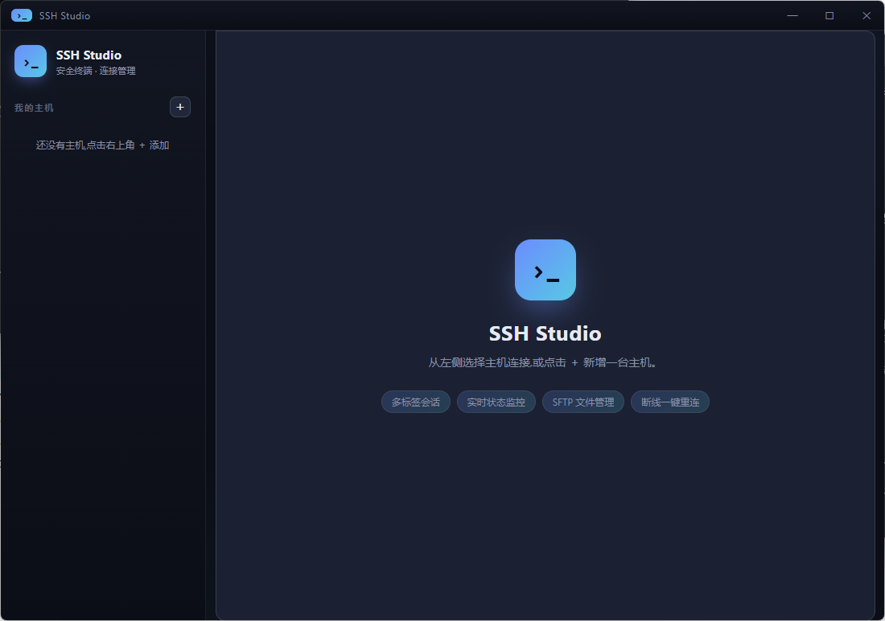

# SSH 连接工具

一个基于 **Electron + ssh2 + xterm.js** 的图形化 SSH 客户端,支持密钥与密码两种认证方式。

## 功能

- 📋 **主机管理** —— 保存常用主机(地址、端口、用户名、认证信息),一键连接
- 🔑 **双认证** —— 支持密码登录,也支持 SSH 私钥(可带口令 passphrase);未保存凭据时连接前弹窗询问密码
- 🖥️ **真实终端** —— 基于 xterm.js,支持彩色输出、光标、自动适配窗口大小(交互式 shell)
- 🗂️ **多标签** —— 同时打开多个会话,标签页切换,连接状态用颜色指示(绿=已连,红=出错)
- 🔁 **断线重连** —— 会话断开/出错时终端浮出「重新连接」按钮,复用已填凭据一键重连
- 🛡️ **连接前 TCP 预检** —— 先探测 host:port 可达性,端口不通时给出明确提示,而非含糊的握手错误
- 📊 **服务器状态栏** —— 实时显示响应延迟、CPU 负载、内存、磁盘、运行时长、本次连接时长;**指标超阈值自动变色告警**(琥珀=警告/红=严重),采集间隔可在状态栏切换(2s/5s/10s/30s/关闭)并记忆
- 📁 **文件管理(SFTP)** —— 浏览远程目录,上传 / 下载 / 新建文件夹 / 重命名 / 删除,复用当前 SSH 连接
- ⌨️ **keyboard-interactive** —— 兼容需要交互式认证的服务器

## 安装与运行

```bash
npm install
npm start
```

> Node 18+(已在 Node 24 上验证)。首次 `npm install` 会下载 Electron,可能较慢。

## 使用

1. 点击左侧栏右上角 **＋** 新增主机,填写地址 / 端口 / 用户名。
2. 选择认证方式:
   - **密码**:填写密码(留空则连接时弹窗询问)。
   - **密钥**:填写私钥文件的绝对路径,如 `C:\Users\you\.ssh\id_rsa`;私钥若加密再填口令。
3. 点击主机条目即可连接,终端在右侧打开。
4. 标签页的 **✕** 关闭并断开会话。

## 数据存储

主机配置保存在 Electron 用户数据目录下的 `hosts.json`,应用设置(如采集间隔)保存在 `settings.json`:

- Windows: `%APPDATA%\ssh-connect-tool\`(含 `hosts.json`、`settings.json`)

> ⚠️ 安全提示:为方便起见,密码 / 私钥口令以明文存于该 JSON。仅在个人可信机器上保存敏感凭据;生产环境建议使用密钥认证并将口令留空。

## 项目结构

```
src/
  main.js              主进程:窗口、主机持久化、ssh2 连接管理
  preload.js           安全桥接(contextBridge 暴露 window.api)
  renderer/
    index.html         界面结构
    styles.css         样式
    renderer.js        界面逻辑、xterm 终端、标签管理
```

## 技术说明

- SSH 连接运行在主进程(Node 环境),通过 IPC 与渲染进程通信;渲染进程关闭了 `nodeIntegration`,只通过 `contextBridge` 暴露受限 API,较为安全。
- 终端输入输出通过 `ssh2` 的 shell channel 双向流转;窗口尺寸变化会调用 `setWindow` 同步到远端。
